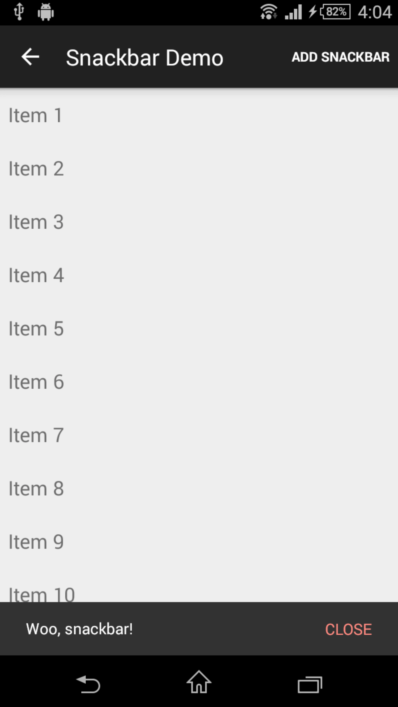
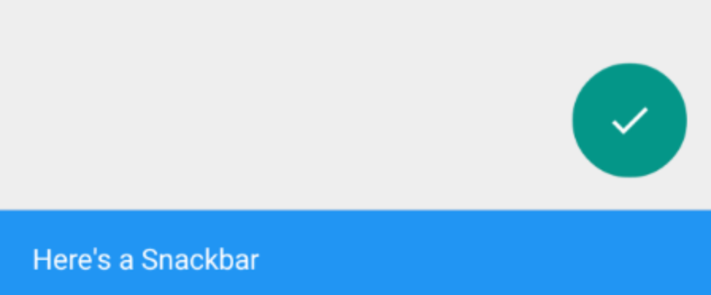
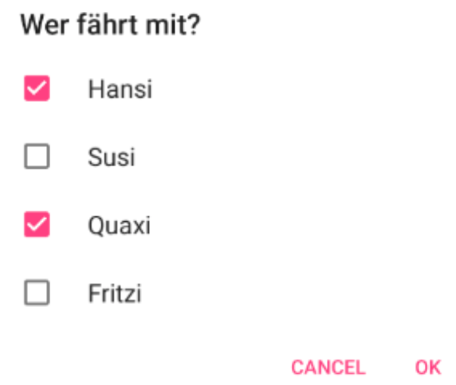
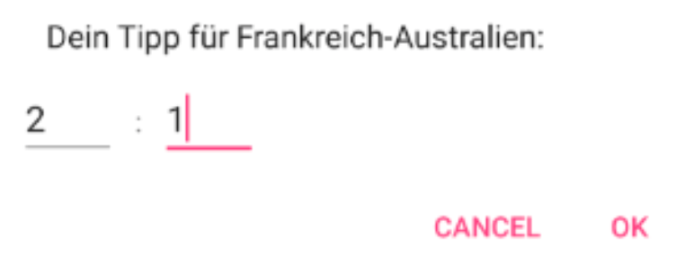
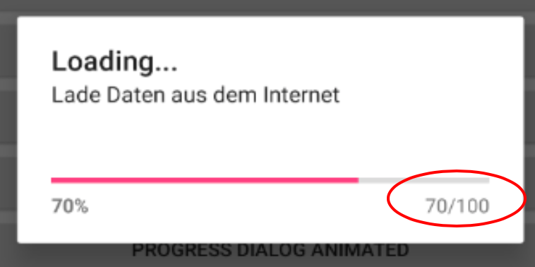

# Dialoge in Android

Es gibt unter Android einige vorgefertigte Dialoge zur Anzeige von Meldungen an den Benutzer bzw. zur Bestätigung von Eingaben, usw. Wie bei Dialogen üblich, sind diese modal, d.h. die App blockiert solange, bis der Dialog wieder geschlossen wird.

Mit der Klasse ```AlertDialog``` kann man verschiedene vorgefertigte Dialoge erzeugen und anzeigen. Dabei kann man diese Dialoge durch Methoden konfigurieren – dazu wird die Klasse ```AlertDialog.Builder``` benutzt.

## Wiederholung Toast Klasse
Für kurze Mitteilungsdialoge gibt es die bereits bekannte Klasse ```Toast```. Diese Mitteilung verschwindet aber nach einer gewissen Zeit wieder von selbst:

```java
Toast.makeText(MainActivity.this, "Message", Toast.LENGTH_SHORT)
     .show()
```
## Snackbar - Der Nachfolger von Toast
Snackbars bieten ein leichtgewichtiges Feedback über Operationen. Sie blenden ähnlich wie Toasts eine kurze Nachricht am unteren Rand der App ein. Sie legen sich über alle anderen Views. Nach einem Timeout verschwinden sie wieder automatisch von selbt.

Um eine Snachbar einzublenden verwenden wir folgenden Code:

```java
Snackbar.make(findViewById(android.R.id.content), “Whoo, snackbar!”,Snackbar.LENGTH_LONG).show();
```



Für diese Funktionalität muss folgende Zeile in der Datei ```build.gradle``` hinzugefügt werden:
```
compile 'com.android.support:design:22.2.1'
```
... _die Versionsnummer kann natürlich abhängig vom API-Level variieren._

Im Unterschied zu Toasts können wir in einer Snackbar auch Buttons einfügen:
```java
.setAction("CLOSE", mOnClickListener);
```
... auf diesen Event können wir natürlich wie gewohnt reagieren.

Wir können auch das Aussehen der Snackbar verändern (hier zB in einer Klasse ```DUtils```):

```java
public static void inform(Activity mView, String string, int text_color) {
    Snackbar snack = Snackbar.make(mView.findViewById(android.R.id.content), string, Snackbar.LENGTH_LONG);
    View view = snack.getView();
    TextView tv = (TextView) view.findViewById(android.support.design.R.id.snackbar_text);
    tv.setTextColor(mView.getResources().getColor(text_color));
    //change background color too ?
    view.setBackgroundColor(mView.getResources().getColor(R.color.your_background_color));
    snack.show();
}
DUtils.inform(mContext, getString(R.string.txt_maximum_number_of_options_reached_message), R.color.text_color_of_your_choice);
```
Das Ergebnis sieht dann so aus:


## AlertDialog
Eine ähnliche Funktion lässt sich mit dem AlertDialog erreichen. Dieser bleibt jedoch so lange sichtbar, bis ein Button des Dialogs gedrückt wird.

```java
AlertDialog.Builder alert = new AlertDialog.Builder(this);
alert.setMessage("Whooo Alert....");
alert.setNeutralButton("ok", NULL);
alert.show();
```
Man könnte für den Button einen ClickEvent-Handler registrieren. Im Beispiel wird dies nicht gemacht, daher ist der zweite Parameter null in ```setNeutralButton```. Die Texte sind hier hart codiert – besser wäre wieder, diese über Resourcen zuzuweisen (siehe nächstes Beispiel).

### Method-chaining
Im obigen Beispiel musst die Variable ```alert``` bei jedem Methodenaufruf wiederholt angegeben werden. Da jedoch alle ```AlertDialog.Builder```-Methoden wieder den ```this```-Pointer zurückgeben, kann bzw. sollte man Method chaining benutzen. Dabei ist aufgrund der besseren Lesbarkeit empfehlenswert, bei jeder Methode eine neue Zeile zu beginnen (aber das kennen wir ja schon vom Streaming-API):

```java
new AlertDialog.Builder(this)
    .setMessage("...")
    .setNeutralButton("ok", NULL)
    .show();
```
### Yes-No Dialog
Ganz ähnlich ist ein Ja/Nein-Dialog aufgebaut.  Auch hier soll vorerst noch einmal die ausführliche Variante verwendet werden.

```java
new AlertDialog.Builder(this)
    .setMessage("...")
    .setNeutralButton("ok", NULL)
    .setPositiveButton("yes", new OnClickListener() {
            @Override
            public void onClick(DialogInterface dialog, int which){
                .....
            }
        })
    .setNegativeButton("no", new OnClickListener() {
            @Override
            public void onClick(DialogInterface dialog, int which){
                .....
            }
        }))
    .show();
```
_Natürlich können anstelle der anonymen inneren Klassen auch Lambdas eingesetzt werden!_

### ListDialoge
Man kann mit einem AlertDialog aber auch eine Auswahlliste anzeigen lassen:

```java
new AlertDialog.Builder(this)
    .setMessage("...")
    .setTitle("Wer fährt mit?")
    .setPositiveButton("yes", new OnClickListener() {
            @Override
            public void onClick(DialogInterface dialog, int which){
                .....
            }
        })
    .setNegativeButton("no", new OnClickListener() {
            @Override
            public void onClick(DialogInterface dialog, int which){
                .....
            }
        }))
    .setMultiChoiceItems(R.array.names, selectedListItems,
        ( dialog, which, isChecked) -> {
            .....
        })
    .show();
```
Die Werte der Auswahlliste werden mit setMultiChoiceItems angegeben. Der erste Parameter ist dabei eine Array-Resource (also in res/values/arrays.xml), der zweite ein boolean-Array, das angibt, welche Listeneinträge angehakt sein sollen:
```xml
<string-array name="names">
    <item>Hansi</item>
    <item>Susi</item>
    <item>Quaxi</item>
    <item>Fritzi</item>
</string-array>
```
Als dritter Parameter von setMultiChoiceItems kann eine Listener-Klasse angegeben werden, deren onClick-Methode aufgerufen wird, wenn ein Listeneintrag an-/ausgehakt wird.

### Alternative Steuerelemente in Dialog einbinden
Weitere Auswahlelemente, die in einen Dialog eingebunden werden können:
```java
.setSingleChoiceItems(items, selectedRadio, mListener)
```
__Auswahlmöglichkeit über RadioBox.__

```java
final EditText mTextView = new EditText(this);
...
.setView(mTextView)
```
___Einzeilige Eingabemöglichkeit___

### Dialog mit umfangreicherem Layout
Braucht man im Dialog mehrere Eingabefelder ist das auch kein Problem.

Man entwirft einfach ein neues Layout wie gewohnt und weist es dem Dialog zu. Dazu muss man mit ```getLayoutInflater().inflate()``` aus dem XML-File ein View-Objekt erzeugen.

```java
final View vDialog = getLayoutInflater().inflate(R.layout.insert_result_dialog, null);
new AlertDialog.Builder(this)
    .setMessage("Dein Tipp für Frankreich-Australien:")
    .setCancelable(false)
    .setView(vDialog)
    .setPositiveButton("ok", ( dialog, which) -> handleDialog(vDialog))
    .setNegativeButton("Cancel", null)
    .show();

...

private void handleDialog( final View vDialog) {
    EditText txtShot = vDialog.findViewById(R.id.txtShot);
    EditText txtReceived = vDialog.findViewById(R.id.txtReceived);
    int shot = Integer.parseInt(txtShot.getText().toString());
    int received = Integer.parseInt(txtReceived.getText().toString());
    showToast("Ergebnis: " + shot + ":" + received);
}
```
__Das Layout für den Dialog erzeugt man in Form einer XML-Datei, wie jedes andere Layout in Android auch.__

```xml
<LinearLayout xmlns:android="http:///schemas.android.com/apk/res/android"
    android:layout_width="match_parent"
    android:layout_height="match_parent">
    <EditText
        android:id="@+id/txtShot"
        android:layout_width="wrap_content"
        android:layout_height="wrap_content"/>
    <EditText
        android:id="@+id/txtReceived"
        android:layout_width="wrap_content"
        android:layout_height="wrap_content"/>
</LinearLayout>
```

## Fortschrittsbalken - ProgressDialog

Bei lang laufenden Aktionen, z.B. Lesen von vielen Daten aus der DB, importieren von einer CSV-Datei, Synchronisierung über eine Socket-Verbindung,… sollte man dem Benutzer anzeigen, dass das System nicht hängt, sondern eben beschäftigt ist. Dazu bietet sich der ```ProgressDialog``` an, der eine passende Meldung in einem Dialogfenster anzeigt und die App bis zum Ende der Aktion blockiert.

### Variante "Endlosschleife"
Der PrograssDialog kann einfach das drehende Rad (bzw. Kreis) anzeigen, bis er wieder ausgeblendet wird. Diese Variante ist einfach zu realisieren. Gibt dem Nutzer aber keine weitere Information, wie lange die Operation noch dauern wird.

```java
final ProgressDialog dialog =
        ProgressDialog.show(this,
                            "Message, die angezeigt wird",
                            true, // Zeitdauer. true bedeutet unbegrenzt
                            false); // ist der Dialog unterbrechtbar?

new Thread()() -> {
    importFromCsv();
    dialog.dismiss();
}).start();
```


### Progress Dialog mit Fortschrittsbalken

Statt des drehenden Kreises wird ein horizontaler Fortschrittsbalken angezeigt, der angibt wieviel Prozent der Operation bereits abgeschlossen sind.

Dafür muss der ProgressDialog entsprechend mittels ```ProressDialog.STYLE_HORIZONTAL``` konfiguriert werden:

```java
private ProgressDialog dialog;
public void btnProgressDialogAnimatedClicked(View view) {
    dialog = new PrograssDialog(this);
    dialog.setMessage("Message....");
    dialog.setTitle("Titel vom Dialog...");
    dialog.setCancelable(false);
    dialog.setProgressStyle(PrograssDialog.STYLE_HORIZONTAL);
    dialog.show();
    new Thread( () -> {
        loadData();
        dialog.dismiss();
    }).start();
}
```



#### Aktualisieren der Fortschrittsanzeige

In jenem Codeblock, der die länger andauernden Aktionen ausführt, kann der Fortschritt auf zwei verschiedene Arten gesetzt werden:
- ```incrementProgressBy(intValue)```: so kann der relativeWert angegeben werden, um den der Wert im ProgressBar erhöht wird.
- ```setProgress(intValue)```: so kann der absolute, angezeigte Wert gesetzt werden.

_Beide Werte müssen zwischen 0 und 100 (Prozente) sein!_

```java
private void laodData() {
    try {
        int nr = 10;
        dialog.setProgress(100);
        for (int i=0; i<nr; i++) {
            Thread.sleep(1000);
            dialog.incrementProgressBy(-100/nr);
        }
    } catch (InterruptedException e) {
        e.printStackTrace();
    }

}
```
