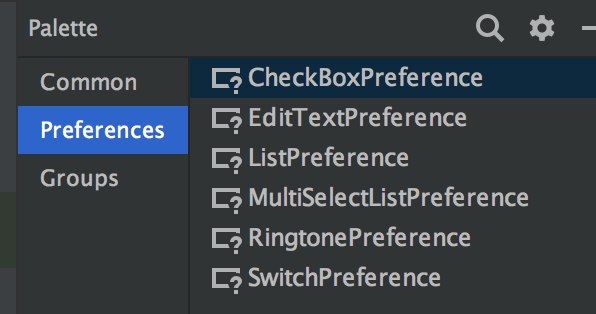
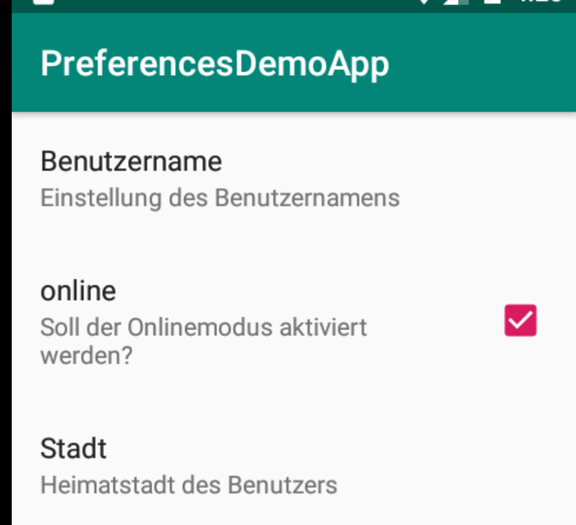
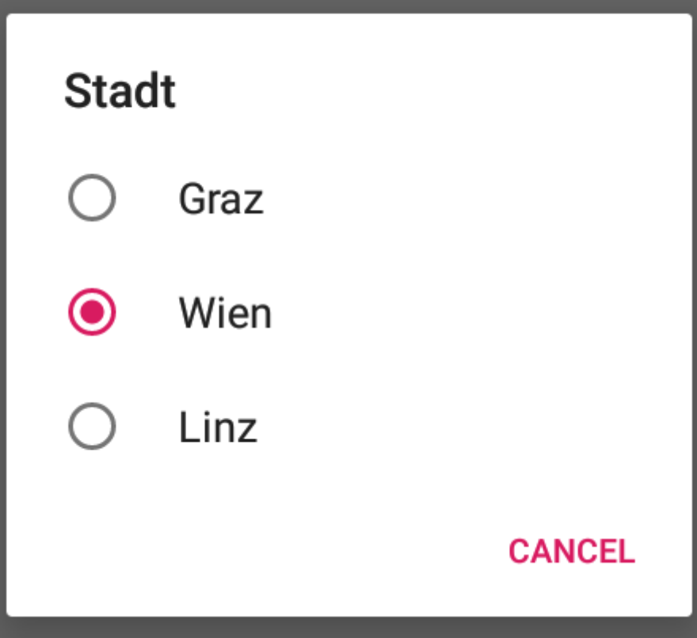

# Preferences
Preferences sind Benutzereinstellungen, die **für die gesamte App gültig** sind. Sie sollen auch nach Beenden der App und erneutem Starten wieder zur Verfügung stehen.
Es handelt sich um **Name/Wert-Paare**. Üblicherweise können diese über einen Menüpunkt geöffnet, bearbeitet und gespeichert werden. Als Eingabe eignen sich dazu Textfelder, Checkboxen, Listen usw.
Preferences sind nur innerhalb einer App sichtbar – andere Applikationen haben darauf keinen Zugriff.
Dabei wird man von Android gut unterstützt.

**Vorgehensweise:**
1.	XML-Resourcefile in res/xml erzeugen und entsprechend konfigurieren
1.	Fragment-Klasse erstellen, die das XML-File anzeigt
1.	Neue Activity programmieren, die das Fragment anzeigt
a.	Diese neue Activity im Manifest registrieren (geht wieder automatisch)
1.	Aufruf der Activity an Event binden – üblicherweise ist das ein Click auf einen OptionsMenu-Eintrag

## XML Ressource erzeugen
Als Name des XML-Files für die App-Einstellungen hat sich **preferences.xml** eingebürgert. Man könnte aber auch jeden beliebigen anderen Namen wählen.
_**Wichtig: das File muss im Verzeichnis res/xml liegen!**_

Im Dialog dann für _File Name_ **preferences.xml** auswählen.
Im Feld _Resource type_ **XML** wählen und als
_Root element_ sollte **PreferenceScreen** stehen.

Nun können die einzelnen Einträge entweder mittels Designer-Sicht grafisch oder direkt im XML-Editor als Text hinzugefügt werden.

Die XML Datei könnte etwa so aussehen:
```xml
<?xml version="1.0" encoding="utf-8"?>
<androidx.preference.PreferenceScreen xmlns:android="http://schemas.android.com/apk/res/android">
    <EditTextPreference
        android:defaultValue="Franz-Xaver"
        android:key="username"
        android:selectAllOnFocus="true"
        android:singleLine="true"
        android:summary="Einstellung des Benutzernamens"
        android:title="Benutzername" />
    <CheckBoxPreference
        android:defaultValue="true"
        android:key="online"
        android:summary="Soll der Onlinemodus aktiviert werden?"
        android:title="online" />
</androidx.preference.PreferenceScreen>
```
Die wichtigsten Attribute, die im Rahmen von Preferences verwendet werden können sind:


| Android-Attribut|Beschreibung|
| :-: | ---------|
| key |	Eindeutige Bezeichnung des Wertes. Damit kann man später auf die Einstellung zugreifen. |
| Title | Diese Bezeichnung sieht der Benutzer._Wie immer kann der Text direkt eingetragen oder über eine string-Resource definiert werden, wobei wenn immer möglich die Resource-Variante zu bevorzugen ist._ |
| summary | Kurze Beschreibung der Einstellung. Erscheint unterhalb des Titels. |
| defaultValue | Standardwert für Listen |
| entries |array-Resource mit den angezeigten Werten der Liste |
| entryValues | array-Resource mit den gespeicherten Werten der Liste |

Weitere Informationen zu möglichen Attributen findet ihr unter https://developer.android.com/reference/android/preference/Preference.html

So kann man z.B. den Inhalt einer Texteingabe mit `android:password="true"` verbergen.
Im Designer sieht man dann auch, wie es aussieht:


## ListPreference
Mittel `ListPreference` können Auswahllisten definiert werden:


```xml
<ListPreference
    android:defaultValue="1100"
    android:entries="@array/cities"
    android:entryValues="@array/city_values"
    android:key="city"
    android:summary="Heimatstadt des Benutzers"
    android:title="Stadt" />
```
Die Array-Werte werden dabei wie immer in einem eigenen XML-File **arrays.xml** gespeichert.
Beispiel für array-Resource (im Verzeichnis `res/values`):

```xml
<?xml version="1.0" encoding="utf-8"?>
<resources>
    <string-array name="cities">
        <item>Graz</item>
        <item>Wien</item>
        <item>Linz</item>
    </string-array>
    <string-array name="city_values">
        <item>8010</item>
        <item>1100</item>
        <item>4020</item>
    </string-array>
</resources>
```
Im Design Guide von Android findet man Hinweise, wie Preferences im Sinne des Erscheinungsbildes von Android Apps gestaltet werden sollten: https://source.android.com/devices/tech/settings/settings-guidelines
## Fragment
Fragments werden bei Android häufig eingesetzt, sie werden später noch im Detail besprochen. Preferences sollen seit Android 3.0 in einem Fragment angzeigt werden. Fürs erste reicht es, dass wir das einfach zur Kenntnis nehmen, ohne uns wirklich mit Fragments zu beschäftigen.

_Seit API-Level 28 gilt die Klasse `PreferenceFragment` als deprecated. Stattdessen sollte von der Klasse `PreferenceCompatFragment` abgeleitet werden._
(https://developer.android.com/reference/android/preference/PreferenceFragment)

Die Klasse wird über Java  New Class erstellt und von PreferenceFragmentCompat abgeleitet. Der Inhalt der Klasse ist überschaubar:
```java
package net.eaustria.preferencesdemoapp;

import android.os.Bundle;
import android.support.v7.preference.PreferenceFragmentCompat;

public class MySettingsFragment extends PreferenceFragmentCompat {
    @Override
    public void onCreatePreferences(Bundle savedInstanceState, String rootKey) {
        setPreferencesFromResource(R.xml.preferences, rootKey);
    }
}
```
_Sollte die Klasse `PreferenceFragmentCompat` nicht gefunden werden können, so ist in der Datei `build.gradle` (Module: app) folgender Eintrag im Abschnitt **dependencies** zu ergänzen:_
```
implementation 'com.android.support:preference-v7:28.0.0'
```
## Dazugehörige Activity
Ein Fragment ist ohne Activity nicht sichtbar. Es muss daher eine Activity programmiert werden, die obiges Fragment beinhaltet. Daher braucht diese Activity aber auch kein Layout:
```java
public class MySettingsActivity extends AppCompatActivity {
    @Override
    protected void onCreate(Bundle savedInstanceState) {
        super.onCreate(savedInstanceState);
        getSupportFragmentManager()
                .beginTransaction()
                .replace(android.R.id.content, new MySettingsFragment())
                .commit();
    }
}

```
## Activity aufrufen
Zuletzt muss der Aufruf der Preference-View noch an ein Event gebunden werden. Meist definiert man dazu einen Button im OptionsMenu, als Icon nimmt dabei üblicherweise ic_menu_preferences:

Dazu benötigen wir zuerst eine XML-Menu Ressource:
```xml
<?xml version="1.0" encoding="utf-8"?>
<menu xmlns:android="http://schemas.android.com/apk/res/android">
    <item
        android:id="@+id/menu_preferences"
        android:icon="@android:drawable/ic_menu_preferences"
        android:title="Einstellungen" />

</menu>
```
... und binde diese danach in der in der Activity ein:
```java
@Override
public boolean onCreateOptionsMenu(Menu menu) {
    getMenuInflater().inflate(R.menu.optionsmenu, menu);
    return super.onCreateOptionsMenu(menu);
}

@Override
public boolean onOptionsItemSelected(MenuItem item) {
    if (item.getItemId() == R.id.menu_preferences) {
        Intent intent = new Intent(this, MySettingsActivity.class);
        startActivityForResult(intent, RQ_PREFERENCES);
    }
    return super.onOptionsItemSelected(item);
}
```
... und die Preferences werden nun bei Auswahl des entsprechenden Menu angezeigt:



... die Auswahl der Heimatstadt erfolgt aus der Liste:



## Zugriff auf die Preferences
Preferences haben natürlich nur Sinn, wenn sie irgendwo im Programm verwendet werden. Das erfolgt über eine Instanz der Klasse `SharedPreferences`. Shared ist dabei als „gemeinsam für alle Activities einer App“ und nicht auf „gemeinsam für alle Apps des Smartphone“ zu verstehen.

Die Zugriffsklasse `SharedPreferences` hat Zugriffsmethoden auf die Einträge im Preference-XML wie `getString()`, `getInt()`, … Dieses SharedPreferences-Objekt holt man sich am besten in der `onCreate-Methode`. Man legt sie aber nicht mit `new` an, sondern erhält eine Referenz über den PreferenceManager:
```java
private SharedPreferences prefs;

@Override
protected void onCreate(Bundle savedInstanceState) {
    super.onCreate(savedInstanceState);
    setContentView(R.layout.activity_main);
    prefs = PreferenceManager.getDefaultSharedPreferences(this);
}
```
Mit der Variable **prefs** greift man dann auf die einzelnen Preference-Werte zu.
Die Parameter sind dabei:
1.	der Name der Preference (android:key im XML-File)
1.	der default-Wert, falls es den key nicht gibt.

```java
public void showPrefs(View view) {
    String username = prefs.getString("username", "Not available");
    boolean isOnline = prefs.getBoolean("online", false);
    int zipCode = Integer.parseInt(prefs.getString("city", 0));
    String msg = String.format("user:%s - PLZ:%d - online:%b",
                                username, zipCode, isOnline);
    Toast.makeText(this, msg, Toast.LENGTH_LONG).show();
}
```
Mit folgendem Code kann man über alle verfügbaren Preferences iterieren:
```java
prefs.getAll()
        .entrySet()
        .stream()
        .forEach(entry -> Log.d(TAG,
            String.format(" %s --> %s", entry.getKey(), entry.getValue())
        ));
```
## Auf Änderungen der Einstellungen reagieren
Man kann sich beim SharedPreferences mit einem Listener registrieren, damit man bei Änderungen in den Einstellungen informiert wird. Am einfachsten wäre es mit einer anonymen Klasse, das sollte man aber nicht tun, weil es dann oft nach einiger Zeit nicht mehr funktioniert!!!!
Grund ist der Garbage Collector – siehe https://stackoverflow.com/questions/2542938/sharedpreferences-onsharedpreferencechangelistener-not-being-called-consistently/3104265).

Stattdessen soll man sich **den Listener in einer Instanzvariable speichern:**
```java
private SharedPreferences prefs;
private SharedPreferences.OnSharedPreferenceChangeListener preferencesChangeListener;

@Override
protected void onCreate(Bundle savedInstanceState) {
    super.onCreate(savedInstanceState);
    setContentView(R.layout.activity_main);
    prefs = PreferenceManager.getDefaultSharedPreferences(this);
    preferencesChangeListener = ( sharedPrefs, key ) -> preferenceChanged(sharedPrefs, key);
}
private void preferenceChanged(SharedPreferences sharedPrefs, String key) {
    String sValue = sharedPrefs.getString(key, "");
    Toast.makeText(this, key + " new Value: " + sValue, Toast.LENGTH_LONG).show();
}
```
### Rücksicht auf verschiedene Datentypen der Exceptions
Bei obigem Code bekommt man noch ein Exception, wenn sich eine Einstellung ändert, die nicht vom Typ String ist. Hat man also auch Nicht-String-Eigenschaften, sollte der Code in etwa so aussehen:
```java
private void preferenceChanged(SharedPreferences sharedPrefs, String key) {
    Map<String, ?> allEntries = sharedPrefs.getAll();
    String sValue = "";
    if (allEntries.get(key) instanceof String)
        sValue = sharedPrefs.getString(key, "");
    else if (allEntries.get(key) instanceof Boolean)
        sValue = String.valueOf(sharedPrefs.getBoolean(key, false));        
    Toast.makeText(this, key + " new Value: " + sValue, Toast.LENGTH_LONG).show();
}
```
## Eingaben bei Preference prüfen
Häufig möchte man Eingaben in den Preferences vorher auf Gültigkeit prüfen, z.B. ob ein Passwort lang genug ist, usw. In diesem Fall wird im SettingsFragment mit `findPreference` die Preference mit ihrem key gesucht und darauf dann ein bestimmter Listener registriert - dieser muss vom Typ `OnPreferenceChangeListener` sein. Die Methode `onPreferenceChange` dieses Listeners gibt dann `true` zurück, falls die Eingabe akzeptiert werden soll, und `false` zum Ablehnen der Änderung.
```java
@Override
public void onCreatePreferences(Bundle savedInstanceState, String rootKey) {
    setPreferencesFromResource(R.xml.preferences, rootKey);
    Preference prefUsername = findPreference("username");
    prefUsername.setOnPreferenceChangeListener( (preference, newValue) -> {
        Log.d(TAG, "onPreferenceChange: " + preference.getKey() + " --> " +
                newValue.toString());
        if (preference.getKey().equals("username")) {
            String newUsername = newValue.toString();
            boolean isValid = newUsername.length() > 3;
            Log.d(TAG, "onPreferenceChange: username " +
                    (isValid ? "" : "NOT ") + "accepted");
            return isValid;
        }
        return true;
    });
}
```
## Einstellungen per Java Code ändern
Man kann auch mittels Java-Code Werte in den Preferences ändern/hinzufügen. Z.B. könnte man sich die zuletzt angerufene Nummer speichern o.ä.

Dazu braucht man die Klasse `SharedPreferences.Editor`:
```java
public void editPrefs(View view) {
   SharedPreferences.Editor editor = prefs.edit();
   editor.putString("test", "" + random.nextInt(100));
   editor.commit();
}
```
Damit die Änderungen auch in die Datei gespeichert werden, darf man `commit()` nicht vergessen.
Auch in diesem Fall wird der `OnSharedPreferencesChanged-Listener` über die Änderung (diesmal mit key „dummy“) informiert

### Unterschied zwischen `commit` und `apply`
Es wird empfohlen, anstelle von `commit()` die Methode `apply()` zu verwenden, weil diese sowohl schneller als auch asynchron arbeitet.

Siehe: https://stackoverflow.com/questions/5960678/whats-the-difference-between-commit-and-apply-in-shared-preference


```java
prefs.edit()
    .putString("dummy", "" + random.nextInt(100))
    .apply();
```
## Standardwerte (=DefaultValues)
Ein kleines Problem gibt es noch mit den Default values. Diese kann man ja im XML-File notieren. Andererseits muss man beim Lesen der Einstellungen im Java-Code, also z.B. mit `prefs.getString()`, immer ebenfalls einen Defaultwert angeben.

Es wird daher empfohlen, die Standardwerte nicht im XML-File anzugeben, sondern nur im Java Code und dafür zu sorgen, dass gleich zu Beginn diese zumindest ein Mal in die Datei geschrieben werden. Damit hat man eine einzige zentrale Stelle, wo die Standardwerte vorkommen.

```java
private void assertPreferencesInFile() {
  try {
      String versionKey = "longVersionCode";
      long currentVersion = getPackageManager()
              .getPackageInfo(getPackageName(), 0)
              .getLongVersionCode();
      int lastStoredVersion = prefs.getInt(versionKey, -1);
      if (lastStoredVersion == currentVersion) return;
      prefs.edit()
              .putInt(versionKey, currentVersion)
              .putString("username", prefs.getString("username", "Max"))
              .putString("city", prefs.getString("city", "1100"))
              .putBoolean("online", prefs.getBoolean("online", false))
              .apply();
  } catch (Exception e) {
      Log.e(TAG, "asertPreferencesInFile: ", e);
  }
}
```
